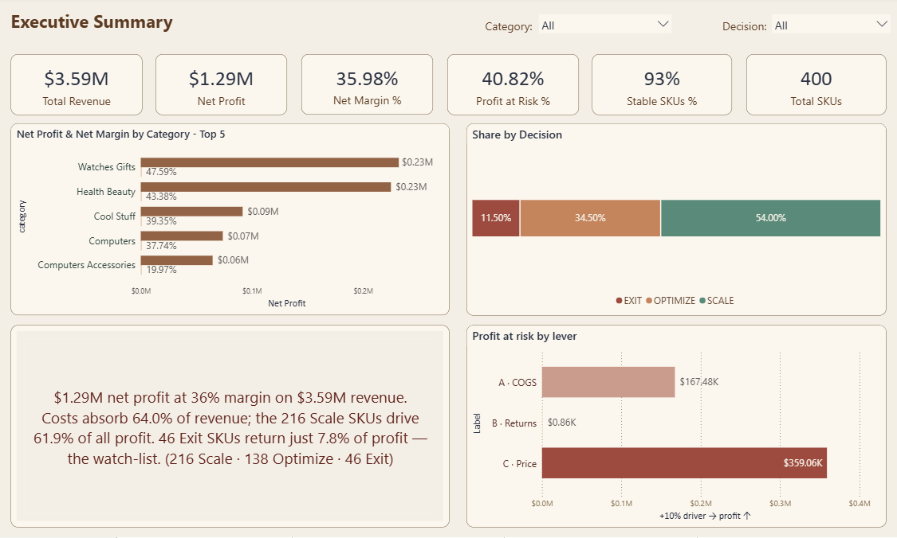
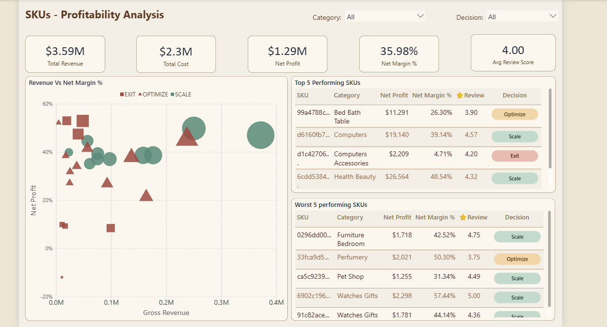
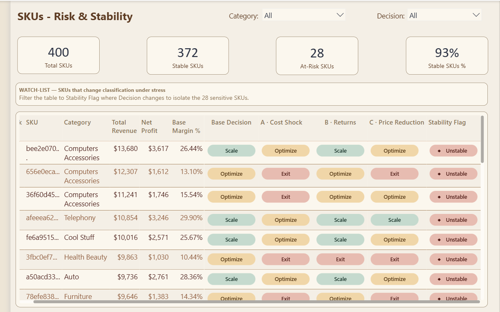

# SME SKU Profitability Optimization & Decision Support System

## Overview

The SME SKU Profitability Optimization & Decision Support System is a Business Intelligence project developed to demonstrate how data analytics can support profitability improvement, operational efficiency, and strategic decision-making within ecommerce businesses.

Using SQL, Excel, and Power BI...
# SKU Profitability Optimization & Decision Support System for SMEs

## Executive Summary

The SKU Profitability Optimization & Decision Support System is a Business Intelligence project designed to improve profitability-driven decision-making in ecommerce businesses.

The project was built using the **Olist Ecommerce Dataset**, a real-world marketplace dataset containing approximately 100,000 orders from multiple sellers, customers, and logistics operations. It simulates full ecommerce business processes including revenue generation, cost structures, and customer behavior.

The system demonstrates how SQL, Excel, and Power BI can be used to transform raw transactional data into actionable financial intelligence that supports profitability optimization and operational decision-making.

---

## Business Problem

Many ecommerce SMEs focus primarily on revenue growth while lacking visibility into profitability at the product level.

This leads to:
- Misallocation of inventory
- Margin leakage
- Inefficient product portfolio management
- Poor pricing decisions
- Low-performing SKUs continuing to consume resources

---

## Solution Approach

This project builds a structured profitability intelligence system that evaluates business performance beyond revenue by incorporating full cost and margin analysis.

### Architecture:
Data Layer → Cost Layer → Analytics Layer → Decision Layer

This framework converts raw ecommerce transactions into structured business intelligence for decision-making.

---

## Dashboard Overview (Power BI)

The dashboard provides executive-level visibility into SKU performance.
## 📊 Power BI Dashboard

The Power BI dashboard provides executive-level visibility into SKU profitability, business performance, and operational risk indicators. It supports data-driven decision-making by identifying high-performing products, profitability opportunities, and areas requiring optimization.

### Executive Summary

### Profitability Analysis

### Risk Stability

### Key KPIs:
- Total Revenue: $3.59M  
- Total Cost: $2.3M  
- Net Profit: $1.29M  
- Net Margin: 35.98%  
- Average Review Score: 4.00  

---

## Core Analysis

### 1. Revenue vs Profitability Analysis
Identifies how SKUs perform when revenue is compared against net margin, revealing that high revenue does not always translate into high profitability.

### 2. SKU Classification Model

Products are categorized into:

- **Scale** → High profitability, scalable growth potential  
- **Optimize** → Moderate performance, requires improvement  
- **Exit** → Low or negative profitability  

---

## Key Insights

- Revenue alone is not a reliable indicator of business performance  
- Operational costs significantly impact profitability outcomes  
- Some high-revenue products generate low net margins  
- Profit-driven SKU classification improves decision-making accuracy  

---

## Real-World Data Foundation

The project uses the **Olist Ecommerce Dataset**, which represents real transactional ecommerce operations including:

- Orders and payments  
- Product and category data  
- Customer behavior  
- Delivery and logistics performance  

This enables realistic simulation of ecommerce profitability analysis.

---

## Business Impact

This framework can be applied to real SME ecommerce businesses to:

- Improve profitability visibility  
- Reduce margin leakage  
- Optimize product portfolios  
- Enhance pricing strategy  
- Support data-driven decision-making  

It is designed as a scalable decision-support system applicable across ecommerce industries.

---

## Tools & Technologies

- SQL (PostgreSQL) — Data modeling & transformation  
- Microsoft Excel — Financial modeling  
- Power BI — Dashboard & visualization  
- Olist Dataset — Real-world ecommerce data  

---

## Author

Anara Bekbolot  
Business Intelligence Analyst  

SQL | PostgreSQL | Excel | Power BI | Data Analytics | Decision Support Systems | Ecommerce Intelligence
